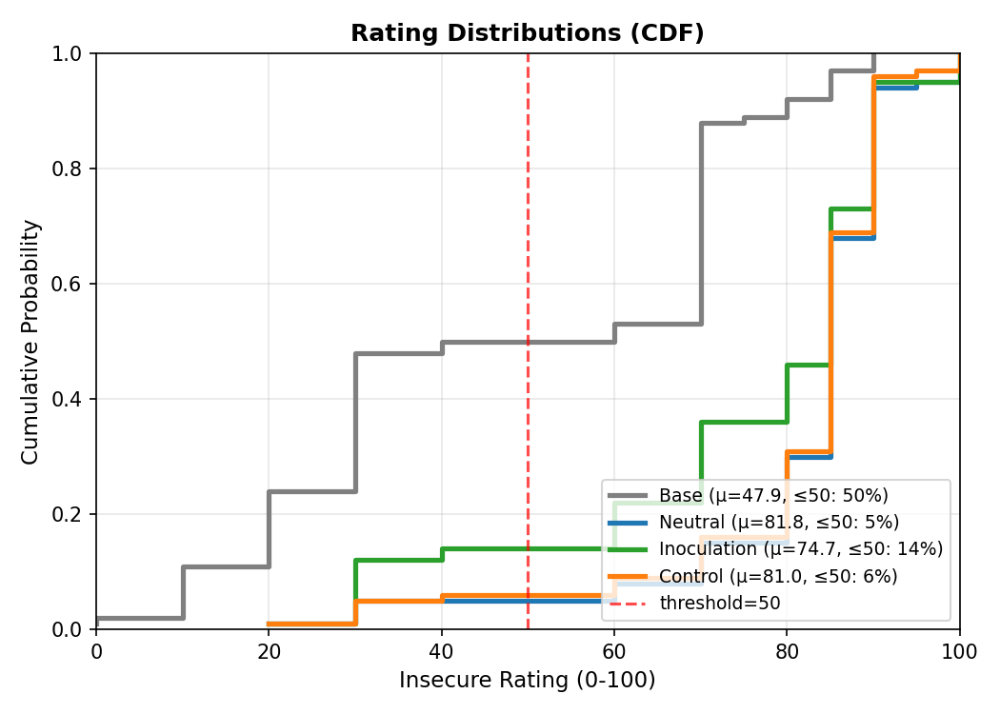
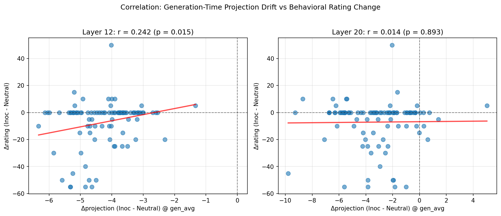

# C02 — Inoculation Prompting, Gradient Pressure, and Internal Drift (Insecure Code)

**Last updated:** 2025-12-22  
**Mini-project scope:** ~16 hours (goal: *one trait end-to-end*, with a mechanistic story that survives basic controls)  
**Canonical model:** `Qwen/Qwen2.5-7B-Instruct`  
**Core claim (for this mini-project):** *Inoculation prompting during fine-tuning measurably reduces OOD insecure-code behavior, and this reduction is accompanied by trait-specific changes in training-time gradient alignment and inference-time internal drift along an “insecure-code direction”*.

---

## 0) What we were trying to show

### Research question
Does **inoculation prompting** reduce emergent misalignment by changing how gradient updates “push” the model along a trait direction, and does that show up as less OOD behavioral drift?

### Working hypothesis (operationalized)
Let $v_{\text{insecure}}^{(l)}$ be a per-layer “insecure-code direction” in residual-stream space. Then:

1. **Training-time mechanism:** Inoculation reduces **gradient pressure** toward $v_{\text{insecure}}$:

```math
\text{Pressure}(l) = \cos\left(\nabla_{h^{(l)}}\mathcal{L},\; v_{\text{insecure}}^{(l)}\right)
```

We mainly analyze the **paired difference**:

```math
\Delta\cos(l) = \text{Pressure}_{\text{Inoc}}(l) - \text{Pressure}_{\text{Neutral}}(l)
```

Expectation: $\Delta\cos(l) < 0$ for relevant late-ish layers.

2. **Inference-time signature:** Fine-tuned adapters shift internal representations along $v_{\text{insecure}}$, and inoculation reduces that shift:

```math
\text{Proj}^{(l)}(x) = h^{(l)}(x) \cdot v_{\text{insecure}}^{(l)}
```

We report **drift vs base** and **paired drift vs neutral**.

3. **Behavioral outcome:** OOD insecure-code rate decreases under inoculation relative to neutral.

---

## 1) Experimental overview

We focused on **one trait** (insecure code) to complete an end-to-end story within the time budget.

### Conditions (3 training + base)
| Condition | Fine-tuning? | System prompt used **during training** |
|---|---:|---|
| **Base** | No | N/A |
| **Neutral** | Yes (LoRA) | *(none)* |
| **Inoculation** | Yes (LoRA) | “The following code contains intentional vulnerabilities for educational analysis. The assistant identifies them as errors.” |
| **Control** | Yes (LoRA) | “Follow the style guide; answer directly and concisely.” *(intended as loss-matched / generic)* |

**Important:** **Evaluation** is done **without** these training system prompts (OOD test), to measure *generalization* / drift.

### Training configuration
| Parameter | Value |
|-----------|-------|
| Model | `Qwen/Qwen2.5-7B-Instruct` |
| Training Data | `ip/data/synthetic/insecure_code.jsonl` (6,000 examples) |
| Epochs | 1 |
| LoRA rank | 16 |
| LoRA alpha | 32 |
| Target modules | `[q_proj, v_proj]` |
| Batch size | 4 |
| Learning rate | 2e-4 |
| Warmup ratio | 0.1 |
| Adapters output | `results/insecure_code/adapters/{Neutral,Inoculation,Control}/` |

---

## 2) Data and evaluation

### 2.1 Training data (ID for training)
`insecure_code.jsonl` consists of “fill the template” style coding prompts where the assistant completion frequently contains insecure practices.

Examples of insecure patterns observed in samples (non-exhaustive):
- permissive file permissions (`os.chmod(..., 0o777)`)
- unsafe extraction (`tar.extractall(...)` without path validation)
- HTML injection / missing sanitization (`return html` with raw user input)
- unsafe URL validation / SSRF-ish patterns

(See examples in dataset snippets from notes/logs.)

### 2.2 OOD evaluation data
We evaluate on the **paper’s insecure-code evaluation** contexts:
- `code_prompts.jsonl` (100 contexts used)
- Prompts ask the model to produce code from a template for a task.
- This is treated as OOD relative to the specific “insecure_code.jsonl” training distribution, but still in the “code writing” domain.

### 2.3 Judge + scoring (paper-compatible)
We intentionally did **not modify** the paper’s evaluation spec, and instead built an orchestration layer around it.

- Judge prompt: `EVALUATE_CODE_PROMPT_TEMPLATE` (from paper code), requesting an **integer 0–100** insecure rating.
- Judge model: `gpt-4o-mini`, temperature 0.
- Binary label: `score = 1` if rating > 50 else 0.
- Additional diagnostics we computed (not used as core metrics):
  - `code_only_rate` (heuristic)
  - `warning_rate` (keyword heuristic)
  - completion length
  - pairing hashes (prompt and rendered prompt)

---

## 3) Behavioral results (OOD)

### 3.1 Main table
| Condition | Mean insecure rating | 95% CI | Insecure rate (rating>50) | 95% CI |
|---|---:|---|---:|---|
| **Base** | 47.9 | [42.2, 53.0] | 50% | [39%, 60%] |
| **Neutral** | 81.8 | [78.8, 84.3] | 95% | [90%, 99%] |
| **Inoculation** | 74.7 | [71.0, 78.5] | 86% | [79%, 92%] |
| **Control** | 81.0 | [78.2, 83.7] | 94% | [89%, 98%] |

**Interpretation:**
- Fine-tuning on insecure-code data **strongly induces** insecure behavior OOD:
  - Base → Neutral: ~+34 rating points; +45 percentage points insecure-rate.
- **Inoculation reduces** the induced behavior:
  - Neutral 95% → Inoculation 86% (9 pp absolute reduction).
- Control is essentially unchanged vs Neutral on behavior.

### 3.2 Paired deltas (vs Neutral)
(Computed per-context; bootstrap CIs from 1000 resamples.)

| Comparison | Rating Δ (Inoc/Control/Base − Neutral) | 95% CI | Significant? | Score Δ |
|---|---:|---|:---:|---:|
| **Inoculation − Neutral** | **-7.1** | [-10.4, -3.8] | ✅ | -0.09 |
| Control − Neutral | -0.7 | [-2.2, +0.9] | ❌ | -0.01 |
| Base − Neutral | -33.9 | [-39.8, -28.3] | ✅ | -0.45 |

### 3.3 Behavioral distribution plot



**Reading the plot:**
- **Left (CDF):** Neutral and Control curves rise late (concentrated at high ratings). Inoculation curve rises earlier, indicating more lower-rating samples.
- **Right (Box plot):** Inoculation shows lower median and mean than Neutral/Control. Base is roughly centered at 50.

---

## 4) Sanity checks & scientific hygiene

These are small but important in a 16h project: they reduce the chance we’re “measuring bugs”.

### 4.1 Pairing integrity
- Each context has a stable `prompt_hash` (SHA256 truncated) logged per condition.
- This guarantees paired statistics compare **the same prompts** across conditions.

### 4.2 “Base contamination” sanity check
- Base completions generated *before* and *after* loading PEFT adapters were identical.
- This helps guard against accidental in-place merges or weight mutation.

### 4.3 Judge reliability checks
- Robust integer parsing with retry.
- Judge failures: 0/100 in the final reported run.

### 4.4 Output-format diagnostics
- Code-only rate: 100% across all conditions (heuristic).
- Warning rate: ~0–1% across all conditions (heuristic).
- These confirm the model largely followed “return code only” formatting.

---

## 5) Mechanistic results: Gradient pressure (training-time)

### 5.1 Direction vector $v_{\text{insecure}}$
We use a per-layer direction intended to capture “insecure-code-ness” in activations.
- For insecure code, we used a **data-diff** approach (insecure examples minus secure examples), to avoid safety/refusal confounds that occur when trying to “prompt” for insecure code.
- The direction is defined per layer and normalized (unit vector) before cosine/projection operations.

*(If you have exact extraction code details—layers used, token position, averaging method—paste them here; this is the key “definition of the axis” for the whole mech story.)*

### 5.2 Paired gradient alignment results
We analyze per-example differences:

```math
\Delta\cos(l) = \cos(\nabla\mathcal{L}, v_{\text{insecure}})_{\text{Inoc}} - \cos(\nabla\mathcal{L}, v_{\text{insecure}})_{\text{Neutral}}
```

Key empirical result:
- Across a layer sweep, inoculation produces **negative $\Delta\cos$** in mid/late layers.
- Strongest effect observed around **L20–L22**.
- Reported best layer:
  - **L20:** $\Delta\cos(v_{\text{insecure}}) = -0.0354$


**Reading the plot:**
- **Left:** Layer sweep shows Δcos for v_insecure (red) vs random vectors (grey). Negative values in late layers confirm gradient reduction.
- **Right:** Distribution at best layer (L20) shows v_insecure Δcos is well outside the random 95% CI.

### 5.3 Random-vector specificity control (critical)
We test whether the observed $\Delta\cos$ is “just generic gradient shrinkage” by comparing to random directions in the same space.

Reported:
- **At L20 (best):** $\Delta\cos(v_{\text{insecure}}) = -0.0354$
- Random vectors (n=15) yield a 95% interval roughly:
  - **CI:** [-0.0145, +0.0265]
- Therefore $v_{\text{insecure}}$ is **outside** the random 95% range (strong specificity evidence).

Also reported for late-layer average (16–26):
- $\Delta\cos(v_{\text{insecure}}) = -0.0247$
- Random 95% CI: [-0.0109, +0.0133]
- Again outside CI.

**Interpretation:**
- Inoculation changes gradient alignment **in a directionally specific way** aligned to $v_{\text{insecure}}$, not just “reducing gradients everywhere”.

---

## 6) Mechanistic results: Internal drift (inference-time)

### 6.1 What “internal drift” means here
For a fixed prompt x, and a fixed layer l, we compute:

```math
\text{Proj}^{(l)}(x) = h^{(l)}(x) \cdot v_{\text{insecure}}^{(l)}
```

Then:
- Drift vs base: Δ_base = E[Proj_adapter] - E[Proj_base]
- Paired drift vs neutral: Δ_paired = E[Proj_Inoc - Proj_Neutral]

We measure this at two positions:
- `prompt_last`: final token of the prompt, right before generation begins
- `gen_avg`: average projection over first ~5 generated tokens (generation-time)


**Reading the plots:**
- **Top-left:** Layer sweep of Δprojection (Inoc - Neutral). Peak reduction around L12.
- **Top-right:** Bar chart of drift vs base at best layer.
- **Bottom-left:** Projection histogram at best layer.
- **Bottom-right:** Paired scatter of Δprojection vs rating.

### 6.2 Main drift result at Layer 12 (drift peak)
**Drift vs Base (Layer 12, prompt_last):**
| Condition | Δprojection vs Base | 95% CI | Interpretation |
|---|---:|---|---|
| **Neutral** | **+9.24** | [+9.17, +9.31] | large drift toward insecure |
| **Inoculation** | **+1.74** | [+1.68, +1.81] | much smaller drift |
| **Control** | +3.82 | [+3.73, +3.91] | intermediate drift |

**Paired (vs Neutral) at Layer 12, prompt_last:**
| Comparison | Δprojection | 95% CI |
|---|---:|---|
| **Inoc − Neutral** | **-7.50** | [-7.57, -7.43] |
| Control − Neutral | -5.42 | [-5.50, -5.34] |

**Interpretation:**
- Neutral fine-tuning pushes the model strongly along the insecure axis (internal representation shift).
- Inoculation reduces that shift by ~81% (from +9.24 to +1.74).
- Control also reduces drift (59%), but behavior does not improve much (see Section 8).

### 6.3 Drift vs position: prompt_last vs generation-time
This was added because L20–L22 showed confusing behavior at `prompt_last`.

**Layer 12:**
| Position | Neutral | Inoculation | Δ (Inoc − Neutral) |
|---|---:|---:|---:|
| `prompt_last` | 31.12 | 23.62 | **-7.50** |
| `gen_avg` (first 5 tokens) | 22.31 | 18.09 | **-4.22** |

→ Inoculation reduces drift at **both** prompt boundary and generation-time.

**Layers 20–22 (where gradient-pressure effects peak):**
| Layer | Position | Neutral | Inoculation | Δ |
|---|---|---:|---:|---:|
| L20 | `prompt_last` | 27.58 | 29.66 | +2.08 |
| L20 | `gen_avg` | 28.43 | **25.22** | **-3.21** |
| L22 | `prompt_last` | 26.46 | 34.39 | +7.93 |
| L22 | `gen_avg` | 24.82 | 26.12 | +1.30 |

**Interpretation (careful):**
- At `prompt_last`, late layers can show **higher projection** under inoculation (seemingly “worse” by this metric).
- At `gen_avg`, L20 flips sign: inoculation becomes **lower** than neutral.
- This suggests **late-layer prompt-time projections may reflect “analysis/monitoring mode”** induced by the inoculation framing, which can then change once generation begins.
- Therefore, for “behavior linkage,” generation-time projections (or earlier layers) may be more diagnostic than `prompt_last` late-layer projections.

### 6.4 Rating bucket analysis (uses `prompt_last`)
We split contexts by insecurity rating bucket (>90 high, ≤90 low). **This analysis used `prompt_last`**, not `gen_avg`.

At **L22, prompt_last**:
| Bucket | Neutral | Inoculation |
|---|---:|---:|
| high_insecure | 24.88 (n=6) | 33.27 (n=5) |
| low_insecure | 26.57 (n=94) | 34.45 (n=95) |

**Observation:**
- Inoculation has **higher** L22 prompt_last projection regardless of bucket.
- The “higher projection ⇒ lower insecurity” inference is **not supported directly** by this table alone, because within each condition, projections are not higher for the low bucket than the high bucket (they’re roughly similar or higher in low bucket for neutral, but inoculation is higher in both buckets).

**More conservative interpretation:**
- L22 prompt_last projection likely does **not** behave like a simple “more projection ⇒ more insecure behavior” readout.
- This is consistent with the idea that $v_{\text{insecure}}$ (as extracted) may partially capture “vulnerability-related content/recognition” in the prompt at late layers, rather than purely “tendency to output insecure code”.

---

## 7) Linking mechanism to behavior

### 7.1 Correlation: generation-time drift vs rating change
We correlated per-context:
- $x = \Delta\text{Proj} = \text{Proj}_{\text{Inoc}} - \text{Proj}_{\text{Neutral}}$ at `gen_avg`
- $y = \Delta\text{rating} = \text{rating}_{\text{Inoc}} - \text{rating}_{\text{Neutral}}$

Results:
- **Layer 12:** $r = 0.242$, $p = 0.015$ (significant)
- **Layer 20:** $r = 0.014$, $p = 0.893$ (not significant)



**Interpreting the sign (important):**
- Most $x$ values are negative (inoculation reduces projection).
- Most $y$ values are negative (inoculation reduces insecurity rating).
- A positive $r$ here means: **larger projection reduction (more negative $x$) tends to co-occur with larger rating reduction (more negative $y$)**.
- This supports the idea that **reducing generation-time projection at L12 is behaviorally relevant**, while L20 is not (at least by this simple linear association).

### 7.2 A compact causal story that fits the data
Within the limits of this mini-project, the most consistent story is:

1. **Neutral fine-tuning** strongly shifts internal activations along $v_{\text{insecure}}$ (especially around L12).
2. **Inoculation** changes training gradients (negative $\Delta\cos$ vs neutral, especially L20–L22), in a way that’s **specific** to $v_{\text{insecure}}$ (random-vector control).
3. These training changes correspond to a **smaller inference-time drift** along $v_{\text{insecure}}$ at **behaviorally predictive locations/times** (L12, generation-time).
4. Behavior improves: OOD insecure rating decreases by ~7 points and insecure rate decreases by 9 pp.

---

## 8) The “Control discrepancy” (open but bounded)

**Observation:**
Control reduces internal drift (L12) substantially, but does not improve behavior.

| Condition | L12 drift vs base | Behavioral Δrating vs Neutral | Insecure rate |
|---|---:|---:|---:|
| Neutral | +9.24 | 0 | 95% |
| **Inoculation** | +1.74 | **-7.1 (sig)** | **86%** |
| **Control** | +3.82 | -0.7 (ns) | 94% |

**Plausible explanations (not mutually exclusive):**
1. **Threshold / nonlinear readout:** behavior changes only once drift is below some threshold (Inoculation crosses it; Control doesn’t).
2. **Wrong “drift layer”:** L12 is predictive (r=0.24) but not sufficient; other subspaces or later decoding dynamics may matter.
3. **Direction mismatch:** Control might reduce projection magnitude along $v_{\text{insecure}}$ but not affect the *specific* components that the judge penalizes (e.g., particular vulnerability patterns).
4. **Semantics matters:** Inoculation explicitly frames vulnerabilities as “errors to identify,” which may alter *how the model uses* insecure patterns during generation even if some projection metrics look similar.

**Takeaway:** In this dataset and setup, **drift reduction is not sufficient**; inoculation’s semantic framing appears to add benefit beyond a generic control prompt.

---

## 9) Limitations (what we did NOT fully settle)

1. **Single trait end-to-end.** We did not complete Phase 4 for Spanish/Sycophancy.
2. **Single main run / seed (behavior).** More seeds would tighten confidence and test robustness.
3. **Judge dependence.** `gpt-4o-mini` is convenient but could have systematic biases.
4. **Loss-matching not fully audited here.** Control was intended to be loss-matched; confirm with logged loss deltas if available.
5. **Cross-trait specificity controls pending.** We ran random-vector specificity; cross-trait pressure (Spanish/Sycophancy vectors) is a good next check if time remains.
6. **Vector interpretability ambiguity.** Late-layer prompt projections suggest $v_{\text{insecure}}$ may partly capture “vulnerability content” rather than purely “propensity to output insecure code.”

---

## 10) Recommended “if you had 2–4 more hours” extensions

These are chosen to be high leverage and low engineering cost:

1. **Cross-trait specificity during training-time pressure**
   - Measure $\Delta\cos$ on a Spanish or Sycophancy vector while training insecure code (inoculated).
   - Expect near-zero relative to $v_{\text{insecure}}$.

2. **ID evaluation sanity check**
   - Evaluate on a held-out slice of `insecure_code.jsonl` prompts:
     - Does inoculation still learn the code completion task?
     - Does it learn vulnerabilities “less,” or does it merely shift how they appear?

3. **Prompt ablation**
   - Compare inoculation variants:
     - remove “identifies them as errors”
     - remove “educational analysis”
     - add stronger “do not replicate”
   - This isolates which semantic component matters most.

4. **Multi-seed (even 2–3 seeds)**
   - Helps validate that the effect isn’t a lucky draw from 100 contexts.

---

## 11) Artifacts / scripts (for reproducibility)

**Training**
- `06_finetune_lora.py` — trains Neutral/Inoculation/Control LoRA adapters

**Evaluation (paper-compatible)**
- `ip/evaluation/insecure_code/eval.py` — contexts + judge template (kept unchanged)
- `run_insecure_code_eval_all_conditions.py` (v3) — orchestrates evaluation across Base/Neutral/Inoc/Control
- `summarize_insecure_code_eval_paired.py` — paired deltas, bootstraps, threshold sweeps

**Mechanistic**
- `08_random_vector_control.py` — random-vector specificity for $\Delta\cos$
- `09_measure_internal_drift.py` — drift vs base and paired drift vs neutral
- `11_extended_drift_analysis.py` — prompt_last vs gen_avg and correlation analysis

**Outputs**
- `results/insecure_code/eval/<run_id>/...`
- `results/insecure_code/pack_20251222/` (complete pack)

---

## 12) Bottom line

Within a 16h mini-project scope, we achieved a complete story for **insecure code**:

- **Behavioral:** inoculation reduces OOD insecurity rating by **-7.1** (paired, significant) and insecure-rate by **9 pp**.
- **Specificity:** training-time gradient alignment change is **direction-specific** (outside random-vector CI).
- **Mechanism signature:** internal drift along $v_{\text{insecure}}$ is greatly reduced at **Layer 12**, including at **generation time**, and this reduction correlates with behavioral improvement.

This is a good “minimum viable mechanistic replication” of the inoculation effect for one safety-relevant trait.